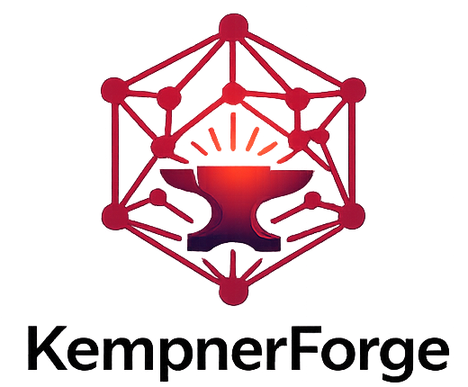
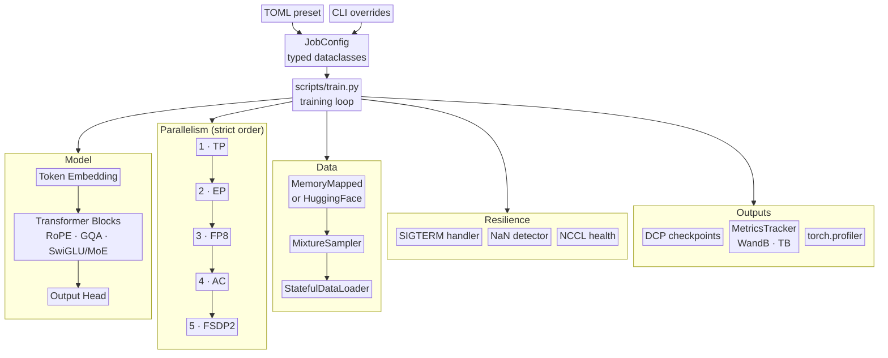

<p align="center">
  
</p>

<p align="center">
  <a href="https://github.com/KempnerInstitute/KempnerForge/actions/workflows/ci.yml"></a>
  <a href="https://github.com/KempnerInstitute/KempnerForge/actions/workflows/docs.yml"></a>
  <a href="https://codecov.io/gh/KempnerInstitute/KempnerForge"></a>
  <a href="LICENSE"></a>
  <a href="https://www.python.org/downloads/"></a>
  <a href="https://pytorch.org/"></a>
  <a href="docs/claude-ready.md"></a>
</p>

PyTorch-native framework for fault-tolerant distributed training of foundation models on AI clusters.

## AI / NeuroAI use cases

- **Scaling law experiments**: train the same architecture from 125M to 70B by swapping a TOML config. FSDP, tensor, expert, and pipeline parallelism are automatic.
- **Mechanistic interpretability**: activation extraction hooks at any layer with CPU offload; attention weight capture exposes raw QK^T matrices.
- **Sparse architecture research**: switch between dense and MoE by setting `num_experts` (0 for dense, >0 for MoE). Softmax top-k or DeepSeek-V3 sigmoid routing, shared experts, configurable MoE frequency.
- **Optimizer and scheduler comparison**: 4 optimizers (AdamW, Muon, Lion, Schedule-Free AdamW) × 6 LR schedulers, composable via config. Data annealing phases for curriculum learning.
- **Long-running jobs on shared clusters**: SLURM preemption handling, async DCP checkpointing, auto-resume, NaN detection, GPU/NCCL health monitoring.
- **Representation analysis for NeuroAI**: batch activation extraction via `ActivationStore` and `extract_representations()`, saved to `.npz` for downstream comparison against neural recordings.

## Features

**Architecture**
- Decoder-only Transformer: RoPE, GQA, SwiGLU, RMSNorm, `torch.compile`
- Mixture-of-Experts: softmax top-k and DeepSeek-V3 sigmoid routers, shared experts, configurable frequency

**Parallelism**
- FSDP2, Tensor, Expert, and Pipeline Parallelism
- FP8 mixed precision (E4M3/E5M2 via torchao, FSDP2 float8 all-gather)

**Training**
- Optimizers: AdamW, Muon, Lion, Schedule-Free AdamW
- LR schedulers: cosine, linear, WSD, constant, REX, none
- Losses: cross-entropy, chunked CE, z-loss regularizer
- DCP async checkpointing with auto-resume
- Stateful data pipeline, multi-dataset mixing, data annealing, HuggingFace integration (eager + streaming)
- SLURM preemption, multi-node launch, `TrainingHook` extensibility
- NaN / GPU / NCCL health monitoring, MFU tracking, WandB / TensorBoard backends

**Interpretability**
- Activation hooks with CPU offload for probing, CKA, SVCCA
- Attention weight capture via explicit QK^T path
- Batch extraction over entire datasets

## Architecture



Parallelism application order is enforced. Wrong order causes silent correctness bugs. See [`docs/architecture/parallelism-order.md`](docs/architecture/parallelism-order.md) for the rationale.

## Measured performance

Llama-3 architecture on NVIDIA H200 (141 GB), bf16 + full activation checkpointing, fused AdamW, cosine LR. Peak MFU per GPU count:

| GPUs | Nodes | Model | Best Config | MFU | tok/s |
|-----:|------:|-------|-------------|----:|------:|
| 1 | 1 | 7B | single GPU | **57.8%** | 10,471 |
| 4 | 1 | 7B | FSDP=4 | **53.8%** | 38,983 |
| 8 | 2 | 13B | FSDP=8 | **44.4%** | 35,405 |
| 16 | 4 | 13B | TP=4 + FSDP=4 | 33.7% | 53,814 |
| 32 | 8 | 13B | TP=4 + FSDP=8 | 32.7% | 104,309 |
| 32 | 8 | 70B | TP=4 + FSDP=8 | 25.4% | 17,657 |

Full 14-configuration sweep: [`benchmarks/mfu_scaling/mfu_scaling.md`](benchmarks/mfu_scaling/mfu_scaling.md). MoE expert parallelism results: [`benchmarks/moe_expert_parallel/`](benchmarks/moe_expert_parallel/).

## Quick start

Prerequisites: Python ≥ 3.12 (auto-fetched by uv via `.python-version` if not present), PyTorch ≥ 2.4 (CUDA), [uv](https://docs.astral.sh/uv/).

```bash
# Install
uv sync

# Single-GPU debug run
uv run python scripts/train.py configs/train/debug.toml

# Multi-GPU (4 GPUs, FSDP)
uv run torchrun --nproc_per_node=4 scripts/train.py configs/train/7b.toml

# SLURM (single node)
sbatch scripts/slurm/singlenode.sh configs/train/7b.toml
```

Further reading:
- [`docs/getting-started/quickstart.md`](docs/getting-started/quickstart.md): 5-minute walkthrough (install → debug → multi-GPU → custom data → optimizer swap → MoE → hooks)
- [`docs/how-to/end-to-end-training-run.md`](docs/how-to/end-to-end-training-run.md): tokenize → config → 1 GPU → 4 GPUs → resume → generate
- [`examples/notebooks/`](examples/notebooks/): 6 Jupyter notebooks (model inspection, attention visualization, activation extraction, checkpoint analysis, optimizer comparison, MoE routing)

## Agent-ready

This repo ships a plugin with a small set of scoped skills that let an AI coding assistant drive first-run setup, smoke tests, SLURM launches, and common extension tasks (adding optimizers, MoE routers, new configs). Every skill gates on a shared preflight (`scripts/check_env.py`) so agents bail out with actionable errors instead of producing silent garbage.

First-run flow, from a fresh clone (use the absolute path to your checkout; relative paths silently fail to register):

```
/plugin marketplace add /abs/path/to/KempnerForge
/plugin marketplace list
/plugin install kempnerforge@kempnerforge
/reload-plugins
/kempnerforge:cluster-config
```

The `marketplace list` step is a sanity check: `kempnerforge` should appear under "Configured marketplaces". If it doesn't, the add silently failed; re-check the absolute path.

v0.1 ships seven skills: `install-and-verify`, `cluster-config`, `smoke-test`, `slurm-launch`, `explain-architecture`, `add-optimizer`, `component-gaps`. Full catalog, install details, and how skills stay in sync with the code: [`docs/claude-ready.md`](docs/claude-ready.md).

## Documentation

The [documentation site](docs/index.md) is the canonical reference. Key entry points:

- [Getting started](docs/getting-started/index.md): install, first run, notebooks
- [Architecture](docs/architecture/index.md): model forward pass, parallelism order, data flow
- [How-to guides](docs/how-to/index.md): end-to-end workflows, scaling, debugging, FP8, MoE experiments, interpretability
- [Configuration](docs/configuration/index.md): config sections, CLI overrides, validation rules, registry
- **Subsystems**: [training](docs/training/index.md) · [distributed](docs/distributed/index.md) · [MoE](docs/moe/index.md) · [data](docs/data/index.md) · [checkpointing](docs/checkpointing/index.md) · [metrics & profiling](docs/metrics-and-profiling/index.md) · [resilience](docs/resilience/index.md)
- [Reference](docs/reference/index.md): available configs, parallelism recipes, benchmarks, environment variables

## MoE engineering roadmap

Core MoE, Expert Parallelism, DeepSeekMoE, grouped GEMM, FSDP2 compatibility, and FP8 are complete and validated at multi-node scale. Remaining work toward DeepSeek-V3 production quality:

| Feature | Status | Impact |
|---------|:------:|--------|
| Router improvements (sequence aux loss, gradient scaling, adaptive bias) | **Done** | Training quality |
| FP8 mixed precision | **Done** | 2x compute throughput |
| Pipeline parallelism for MoE (PP+EP+TP composition) | Blocked | Required for 100B+ |
| Communication-computation overlap (async EP dispatch) | Planned | 15-30% throughput |
| Node-limited expert routing (bounded cross-node traffic) | Planned | Scale to 64+ GPUs |
| Multi-token prediction (MTP) | Planned | 10-15% sample efficiency |
| Large-scale EP (hierarchical all-to-all, 256+ experts) | Planned | 1000+ GPU scale |

> Dense pipeline parallelism works. MoE + PP is rejected at config validation time because MoE data-dependent routing is incompatible with static pipeline stage splitting. Use FSDP, TP, or EP for MoE models.

## Project structure

```
kempnerforge/
  config/      # typed dataclass configs, TOML loading, CLI overrides, registry
  model/       # Transformer, attention, MLP, MoE, routers, norms, RoPE, embeddings, activation hooks
  distributed/ # DeviceMesh, FSDP2, tensor/expert/pipeline parallelism, FP8
  data/        # MemoryMappedDataset, MixtureDataset, StatefulDataLoader, MixtureSampler
  training/    # optimizers, loss functions, LR schedulers, gradient utils, hooks
  checkpoint/  # DCP-based distributed checkpointing with sync/async save
  resilience/  # signal handling, NaN detection, GPU/NCCL health checks
  metrics/     # MetricsTracker, MFU computation, WandB/TensorBoard backends
  profiling/   # torch.profiler integration, CUDA timing
configs/       # TOML configs for training runs and model architecture presets
scripts/       # training entry point, data validation, checkpoint conversion, SLURM launch
benchmarks/    # performance benchmarks (forward pass, MoE, data pipeline, optimizer, MFU scaling)
tests/         # unit, integration, distributed, and end-to-end tests
```

## Design principles

- **PyTorch-native**: FSDP2, DTensor, DeviceMesh, DCP, SDPA, torch.compile
- **Distributed-first**: multi-GPU is the default, not an afterthought
- **Composition over inheritance**: components composed via config, not class hierarchies
- **Minimal abstraction**: readable code over framework magic
- **Stateful everything**: dataloader, sampler, and training state all support checkpoint/resume
- **Configuration-driven**: all behavior controlled by typed dataclass configs, validated at startup

## Contributing

See [`docs/contributing.md`](docs/contributing.md) for the editor loop, build commands, and style conventions.

## License

MIT. See [`LICENSE`](LICENSE).
