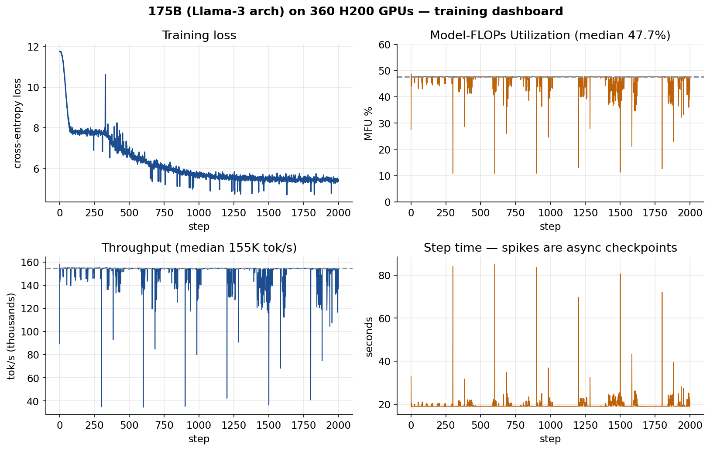
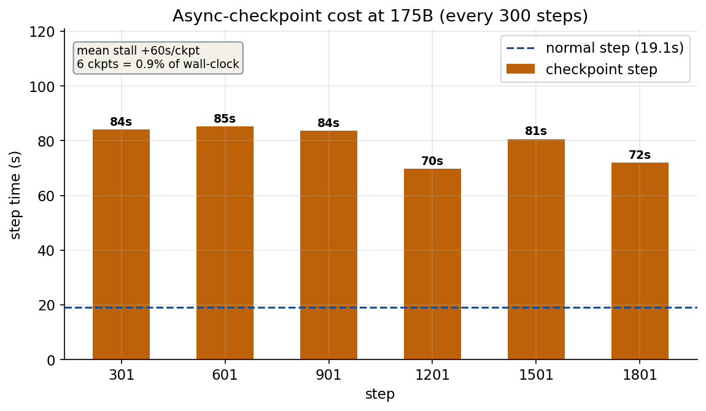

# 175B Dense on 360 H200 GPUs

**Date**: 2026-07-03
**Git**: `5666d0d` (main)
**Hardware**: 90 nodes, 4x NVIDIA H200 SXM (141 GB) per node, NVLink intra-node, InfiniBand NDR inter-node
**Dataset**: FineWeb-Edu, Llama-3 tokenized (499B-token memory-mapped corpus; this run consumed ~5.9B)
**Steps**: 2,000 (~11 h); steady state = median over the back half of the run
**Software**: PyTorch 2.11.0 + CUDA 12.8, Python 3.12
**Parallelism**: TP=4 intra-node (NVLink) x FSDP2 `dp_shard=90` inter-node (InfiniBand)

The largest run performed with KempnerForge to date, and the first above 160 GPUs. It is a
systems benchmark rather than a pre-training run: 2,000 steps and 5.9B tokens produce a healthy
but unconverged loss curve, and no claim is made about model quality.

Fault tolerance is left on, so the run also measures what durability costs at this scale.

## Model

| Field | Value |
|-------|-------|
| Total parameters | **175.0B** (171.8B in layers + 3.15B embeddings) |
| Hidden dimension | 12,288 |
| Layers | 96 |
| Attention heads | 96 (head dim 128) |
| KV heads (GQA) | 8 |
| FFN hidden dim (SwiGLU) | 39,680 |
| Vocabulary | 128,256 (Llama-3 tokenizer) |
| Sequence length | 4,096 |
| Positional encoding | RoPE, theta = 500,000 |
| Normalization | RMSNorm, eps = 1e-5 |
| Embeddings | untied (input + output) |

## Training configuration

| Field | Value |
|-------|-------|
| Per-GPU batch | 8 sequences |
| Global batch | 2.95M tokens/step (8 x 90 dp x 4,096) |
| Gradient accumulation | 1 (load-bearing, see below) |
| Optimizer | AdamW (fused), lr 3e-4, wd 0.1, betas (0.9, 0.95) |
| Schedule | cosine, 5-step warmup, min-lr ratio 0.1 |
| Grad clip | 1.0 |
| Precision | bf16 mixed, fp32 gradient reduction |
| Activation checkpointing | full (per TransformerBlock) |
| `torch.compile` | enabled |
| Checkpointing | DCP `async_mode=async`, interval 300, `keep_last_n=1` |
| Health checks | NCCL every 50 steps |

## Results

| Metric | Value |
|--------|-------|
| Sustained MFU | **47.7%** |
| Throughput | **154,523 tokens/s** |
| Step time | 19.09 s (global batch 2.95M tokens) |
| Aggregate model FLOPs | ~170 PFLOP/s (47.7% x 360 x 989.5 TFLOP/s) |
| Peak memory | 53.8 / 140 GB per GPU (86 GB headroom) |
| Loss | 11.75 -> 5.47 over 5.90B tokens |
| Compute activity | 78% SM / 62% tensor / 24% DRAM active |
| Power / temperature | 619 W / 53 C (no thermal throttling) |



MFU shows no downward drift across roughly 1,000 steady-state steps. Together with the flat
power, temperature and clock traces below, that indicates no thermal throttling, no accumulating
straggler penalty, and no memory fragmentation over the multi-hour run.

**Efficiency improves with scale here, rather than degrading.** 47.7% at 175B exceeds this
framework's own 24.3% at 70B and 32.2% at 13B on 160 GPUs (see
[`../weak_scaling_160gpu/`](../weak_scaling_160gpu/)). Larger matmuls amortize communication and
kernel-launch overhead more effectively. For external context, MosaicML reported 41.25% MFU for
MPT-70B with full activation checkpointing, and TorchTitan reports 33-42% at 8B on H100.

### Memory

Peak memory is 53.8 of 140 GB, leaving 86 GB unused. That is deliberate rather than wasteful:
full activation checkpointing recomputes each block's internal activations during the backward
pass instead of storing them, trading compute for memory, and FSDP2 plus TP shard parameters,
gradients and optimizer state to roughly 8 GB per GPU. The headroom is the lever for pushing MFU
higher, discussed below.

### Asynchronous checkpoint cost

Every 300 steps the run saved a full distributed checkpoint, bf16 weights plus fp32 optimizer
moments, via async DCP.



| Step | Step time | Overhead vs baseline |
|-----:|----------:|---------------------:|
| 301 | 84.1 s | +65.0 s |
| 601 | 85.1 s | +66.0 s |
| 901 | 83.6 s | +64.5 s |
| 1201 | 69.7 s | +50.6 s |
| 1501 | 80.6 s | +61.5 s |
| 1801 | 72.0 s | +53.0 s |

Mean stall **+60 s** per checkpoint; six checkpoints total **0.9%** of wall-clock.

Two things follow. First, "async" is not free at this size: the state is large enough (weights
~350 GB plus optimizer moments ~2.1 TB across the job) that the synchronous *staging* portion of
the save blocks the step by about a minute. Second, it is nonetheless affordable, and the
measured per-checkpoint cost is the input a Young-Daly interval calculation needs.

### Telemetry: a compute-bound signature

DCGM sampling at 100 ms resolution (95,407 retained samples across busy GPUs) gives **78% SM /
62% tensor / 24% DRAM** active. High SM and tensor-core activity with low DRAM activity is the
fingerprint of a compute-bound workload: the tensor cores are the busy resource and memory
bandwidth is not the constraint.

That matters for interpreting the 86 GB of free memory. The run is limited by FLOPs, much of it
activation recomputation, not by capacity, which is why *reducing* checkpointing rather than
enlarging the batch is the lever to raise MFU further.

Hardware health corroborates the flat throughput: 619 W mean (about 89% of the 700 W TDP), 53 C,
SM clock 1,840 MHz near boost, and ~82 GB/s of NVLink traffic, confirming the tensor-parallel
collectives stayed on the intra-node fabric as designed.

The raw telemetry CSVs are not committed; at 24 MB of 100 ms samples they are far larger than the
figures they support.

## The path to 47.7%

The final configuration was not the first one tried, and the route to it is itself a result about
training 175B models with FSDP2.

**1. Gradient accumulation OOMs at this scale.** The initial plan used `grad_accum_steps=8` to
reach a large global batch. It ran out of memory in the first backward pass, twice, at both
seq-len 4096 and 2048, with an identical ~136 GB failure. The failure being
sequence-independent is the clue: with gradient accumulation, FSDP2 retains the **unsharded fp32
gradient** across microbatches, which at 175B is roughly the model size in fp32 divided by TP,
about **87 GB**, on top of the working set. Setting `grad_accum_steps=1` reduce-scatters and
therefore shards gradients every step, and it fits with headroom. Supporting gradient
accumulation at this scale would require gating gradient sync on non-final microbatches.

**2. Small batches are communication-bound.** With `grad_accum=1` and `batch_size=1` the run fit
easily, 19.7 GB, but reached only **8.1% MFU**: one microbatch cannot amortize the per-step FSDP
all-gather and reduce-scatter of 175B parameters, so the GPUs spend most of their time waiting on
communication. Scaling the **batch** rather than the accumulation, to 8, reaches the same
2.95M-token global batch in a single forward/backward and crosses into the compute-bound regime.

**3. Full activation checkpointing caps MFU.** At 47.7% and 53.8 GB the run is compute-bound with
86 GB free. The remaining lever is *selective* checkpointing, recomputing only attention while
storing MLP activations, which would recover recomputation FLOPs. That is untested here: it
carries OOM risk and there is no cheap 175B preflight.

## Limitations

- A single run at one parallelism layout. TP/FSDP combinations and sequence length were not swept
  at this size.
- 5.9B tokens is a systems benchmark. The loss curve is healthy but nowhere near converged.
- MFU and HFU use the standard H200 dense bf16 peak of 989.5 TFLOP/s per GPU. Absolute PFLOP/s
  figures scale with that assumption.
- `grad_accum > 1` is unavailable at this scale, per the first point above.

## Reproduction

One config, one job: 90 nodes for about 11 hours. This is a large allocation, so validate the
launch path at small scale before submitting.

```bash
export DATA=/path/to/tokenized/fineweb-edu     # tokenized_*.bin shards
export PARTITION=<gpu-partition>               # 4 GPUs per node
export ACCOUNT=<slurm-account>
export QOS=<qos>                               # only if your site requires one
export CKPT_DIR=/path/to/scratch               # needs room for one 175B checkpoint

# Prints the resolved configuration and exits without submitting.
bash 175b_360gpu_bench.sh

# Submit. Watch the first ~10 steps and kill early on OOM or hang.
bash 175b_360gpu_bench.sh GO

# Regenerate the tables and the figures above from the log.
uv run python parse_results.py results/175b-360gpu.log
uv run python make_figures.py  results/175b-360gpu.log figures
```

Both scripts read only `results/175b-360gpu.log`, which is committed here, so every number and
both figures in this report can be re-derived rather than trusted. `parse_results.py` needs no
plotting dependencies; `make_figures.py` needs matplotlib from the `dev` group.
